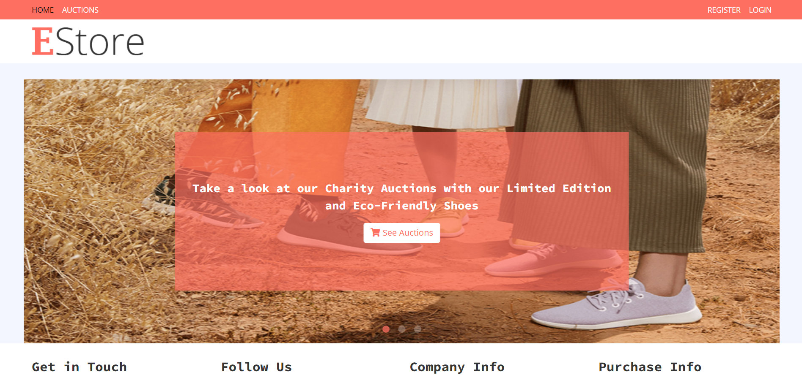

<div id="top"></div>
<!-- PROJECT LOGO -->
<br />
<div align="center">
  <a href="https://github.com/RichardPy02/decentralized_shop">
    
  </a>

  <h3 align="center">Decentralized Shop</h3>

  <p align="center">
      Dapp project implementing a Django application to simulate an online eco-friendly shoe shop putting its product up for charity auctions handled by an ethereum smart contract
    <br/>
    <a href="https://riccardo02.pythonanywhere.com/"><strong>Visit the website »</strong></a> 
  </p>
</div>


<!-- TABLE OF CONTENTS -->
<details>
  <summary>Table of Contents</summary>
  <ol>
    <li>
      <a href="#about-the-project">About The Project</a>
      <ul>
        <li><a href="#built-with">Built With</a></li>
      </ul>
    </li>
    <li>
      <a href="#getting-started">Getting Started</a>
      <ul>
        <li><a href="#prerequisites">Prerequisites</a></li>
        <li><a href="#installation">Installation</a></li>
      </ul>
    </li>
    <li><a href="#usage">Usage</a></li>
    <li><a href="#contributing">Contributing</a></li>
    <li><a href="#contact">Contact</a></li>
  </ol>
</details>


<!-- ABOUT THE PROJECT -->
## About The Project



This project, realized for educational purposes, regards building a decentralized eco-friendly shoe shop putting its products up for charity auctions, handled by an ethereum 
[smart contract](https://ropsten.etherscan.io/address/0xb49468a4560f4929211d7e968b8b16f81562831b)
(deployed on Ropsten Testnet) where users can interact with it to bid and auctioneers can create new auctions, whose receipts are stored in the contract once ended.
Moreover, a website, created with a web framework (in this case [Django](https://www.djangoproject.com/)) using Redis for cache and SQLite as main db, provides online store infrastructure and enables users to interact with the smart contract functionalities, using MetaMask as wallet and provider.

<p align="right">(<a href="#top">back to top</a>)</p>


### Built With

* [Solidity](https://docs.soliditylang.org/en/v0.8.11/)
* [Truffle](https://trufflesuite.com/truffle/)
* [Ganache](https://trufflesuite.com/ganache/)
* [Remix](https://github.com/ethereum/remix-desktop/releases)
* [Javascript](https://www.javascript.com/)
* [Nodejs](https://nodejs.org/it/)
* [Python](https://www.python.org/)
* [Django](https://www.djangoproject.com/)
* [Redis](https://redis.io/)
* [Web3.js](https://web3js.readthedocs.io/en/v1.7.0/)
* [Web3.py](https://web3py.readthedocs.io/en/stable/)
* [MetaMask](https://metamask.io/)

<p align="right">(<a href="#top">back to top</a>)</p>


<!-- GETTING STARTED -->
## Getting Started
These simple instructions will help you to set your environment and try my project locally on your machine.

### Prerequisites

This project assumes you have already installed [Python](https://www.python.org/downloads/) (at least 3.9.9 version), [Redis](https://redis.io/download) (at least 6.2.6 version), [MetaMask](https://chrome.google.com/webstore/detail/metamask/nkbihfbeogaeaoehlefnkodbefgpgknn) with Ropsten Testnet and an account registered as active browser extension,
Truffle, Ganache, Nodejs (if you need help check software homepages) on your system.

### Installation

1. Clone the repo
   ```sh
   git clone https://github.com/RichardPy02/decentralized_shop.git
   ```
2. Install external packages using requirements.txt file
   ```sh
   pip install -r /path/to/requirements.txt
   ```

<p align="right">(<a href="#top">back to top</a>)</p>

<!-- USAGE EXAMPLES -->
## Usage

Once you set your environment, to run the server locally you just need to:
* Initialize the database only one time by executing these commands from your prompt (assuming you're in folder project directory (shop folder): "python manage.py makemigrations" and "python manage.py migrate".
* Activate and connect to a redis server. If you are on windows, open your linux extension (for instance Ubuntu LTS) and execute the command "redis-server".
* Run on your command prompt "python manage.py runserver" and go to http://127.0.0.1:8000/ on your browser. 

I hope you enjoy it ;).


<!-- CONTRIBUTING -->
## Contributing

Contributions are what make the open source community such an amazing place to learn, inspire, and create. Any contributions you make are **greatly appreciated**.

If you have a suggestion that would make this better, please fork the repo and create a pull request. You can also simply open an issue with the tag "enhancement".
Don't forget to give the project a star! Thanks again!

1. Fork the Project
2. Create your Feature Branch (`git checkout -b feature/AmazingFeature`)
3. Commit your Changes (`git commit -m 'Add some AmazingFeature'`)
4. Push to the Branch (`git push origin feature/AmazingFeature`)
5. Open a Pull Request

<p align="right">(<a href="#top">back to top</a>)</p>

<!-- CONTACT -->
## Contact

Riccardo, 
Personal email address: riccardomagni00@gmail.com

Project Link: [https://github.com/RichardPy02/decentralized_shop](https://github.com/RichardPy02/decentralized_shop)

<p align="right">(<a href="#top">back to top</a>)</p>
